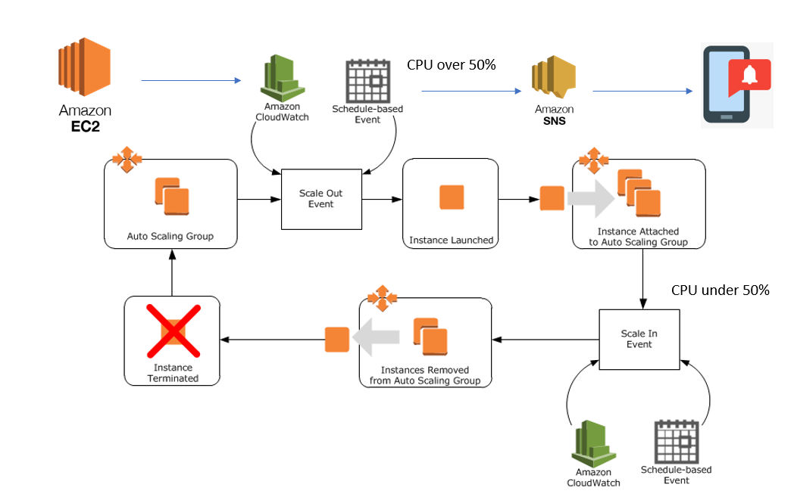

# Monitoring with AWS CloudWatch

Scalability with Autoscaling group and Highly availability with ALB Application Load Balancer

- create an Autoscaling group
    - config min=1 max =3 - attach it to cloud watch

- create a load balancer to balance the load in case of traffic increase or decrease

- Create Diagram for each step and Diagram for entire project/process
- share you repos at 11:30 with initial progress - - share the progress before lunch 1300 then at 1700

= Second Iteration - SNS to send notification email/message 

## Create a launch template
- Click on `Launch Templates` on the side tab
- Click `Create a launch template`
- Launch template name, description: e.g. SRE_sacha_launch_template
- Auto Scaling guidance: Tick `Provide guidance to help me set up a template that I can use with EC2 Auto Scaling`
- Enter a tag: e.g. SRE_sacha_launch_template_app
- AMI: Choose the AMI of your app or start from scratch and choose Ubuntu (HVM), SSD Volume Type
- Instance type: t2.micro (same one used for your instances)
- Key pair login: Choose the key pair you used previously (sre_key)
- Network settings: VPC
- Choose security group
- Click `Create launch template`

## App and db Instances
- Edit security group rules:
    - In app: Make sure db IP, Jenkins IP are updated
    - In db: Make sure app IP, Jenkins IP are updated
- In Jenkins, make sure to update app IP in app_deployment job -> Build -> Execute shell

## Create Auto Scaling Group
- Click on `Auto Scaling Groups` on the side tab under Auto Scaling
### Step 1 Choose launch template or configuration
- Auto Scaling group name: e.g. SRE_sacha_autoscale
- Select the launch template you have created
- Version: Default
### Step 2 Configure settings
- Adhere to launch template
- Network: Leave on Default
- Subnet: default 1a
### Step 3 Configure advanced settings
- Attach to a new load balancer
- Application Load Balancer
- Load balancer name: SRE-sacha-loadbalancer
- Load balancer scheme: Internet-facing
- Listeners and routing: Create a new target group e.g. SRE-sacha-target-group
- Tick `ELB`
- Additional settings: Tick `Enable group metrics collection within CloudWatch`
### Step 4
- Group details:
    - Min capacity: 1
    - Max capacity: 3
- Scaling policies: Target Tracking Policy
- Metric type: Average CPU utilization
- Target value 50
### Step 5
- Click Next
### Step 6
- Click Next
- Create

## Viewing your Auto Scaling Group
- Click on `Auto Scaling Groups` on the side tab under Auto Scaling
- Select the Auto Scaling Group you just created
- In Activity, you should see that an instance has been created
- Click on Instance management to view your instances
- Note that if you terminate an instance created by the Auto Scaling Group, it will automatically spin up a new one. In order to delete these instances completely, you would have to delete the Auto Scaling Group.

## SNS Notifications
- Click on `Auto Scaling Groups` on the side tab under Auto Scaling
- Select the Auto Scaling Group you just created
- In Activity, in Activity notifications click `Create notification`
- Create a topic
    - Name: SRE_sacha_autoscale_notification
    - Recipients: your email address
- Tick the ones you want to be notified for
- Click `Create Notification`
- You should recieve a confirmation email
- Go into your email and click `Confirm Subscription`